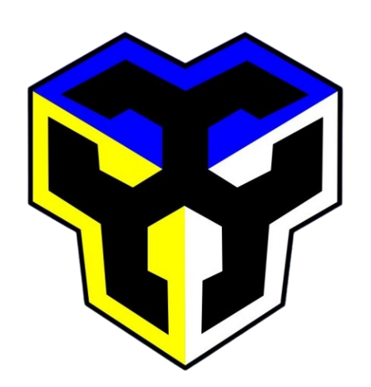

<div align="center">



# SYBORG.TYPE — Typing Arena ⌁

*A cyberpunk typing game built for freshmen who are about to become system builders.*

[](./LICENSE)
[](https://react.dev)
[](https://vercel.com)

</div>

---

## ⌁ What is this?

**SYBORG Typing Arena** is a browser typing game built for incoming **CS, IT, BLIS, and BSIS** freshmen during orientation week. No login, no install — open a link or scan a QR code on any laptop or phone and start typing.

It's not just another speed test. It's themed around the world these students are stepping into: real code snippets, CS/IT terminology, and a difficulty ladder that goes all the way to an infinite roguelike run that *will* try to break you.

> Built by **Jerenze Levi**, "The Apex," President of the **SYBORG Club** (System Builder's Organization) — A.Y. 2026–2027.

---

## 🎮 Features

- **Four difficulty tiers**
  - `Easy` — short common words, generous timing
  - `Normal` — everyday orientation-flavored sentences
  - `Hard` — CS/IT terminology + real code snippets under pressure
  - `Abyss` — **infinite roguelike mode.** Waves speed up, combo multipliers stack, and one bad streak ends in a full **SYSTEM CRASH**.
- **Modes that reshape the whole UI, not just the text**
  - `Blind Mode` — the prompt vanishes and the *entire dashboard* dims into a focus vignette. Type from memory.
  - `Glitch Mode` — scanlines, chromatic aberration, screen tears, screen-shake bursts, and a red "CORRUPTED" rift sweep across the whole page.
- **Live skill analytics** — WPM-over-time graph, a weak-key heatmap, and a consistency score after every run.
- **Local leaderboards** — per-difficulty, stored per browser, no backend required.
- **A hidden signal** somewhere on the About page. Good luck. ⌁

---

## 🛠 Tech Stack

| Layer | Choice |
|---|---|
| Framework | React 18 + Vite |
| Routing | React Router |
| Styling | Tailwind CSS v4 (custom cyber theme + glassmorphism) |
| Animation | GSAP + ScrollTrigger |
| Persistence | `localStorage` (zero backend) |
| Hosting | Vercel (static) |

---

## 🚀 Getting Started

```bash
npm install
npm run dev       # http://localhost:5173
npm run build     # production build → dist/
npm run preview   # preview the production build locally
```

No environment variables, no database setup — clone it and it runs.

---

## 📁 Project Structure

```
src/
  components/     UI building blocks (Navbar, TypingArena, GlitchOverlay, ...)
  pages/          Route-level pages (Home, Play, Leaderboard, Creator)
  data/           Word/code/term pools per difficulty
  hooks/          useTypingEngine (core game logic), useGsapReveal
  lib/            localStorage helpers
  index.css       Theme tokens + all cyber/glitch/blind CSS effects
```

---

## 🏫 Credits

Special thanks to **Dr. Philipcris C. Encarnacion**, instructor of *Office Productivity with MOS (Microsoft Office Specialist)* for the first semester of A.Y. 2026–2027, and Department Dean — whose course shaped the productivity-typing philosophy behind this project.

---

## 📄 License

MIT — see [LICENSE](./LICENSE). Fork it, remix it, use it for your own org's orientation week.

<div align="center">

**⌁ SYBORG · A.Y. 2026–2027 ⌁**

</div>
